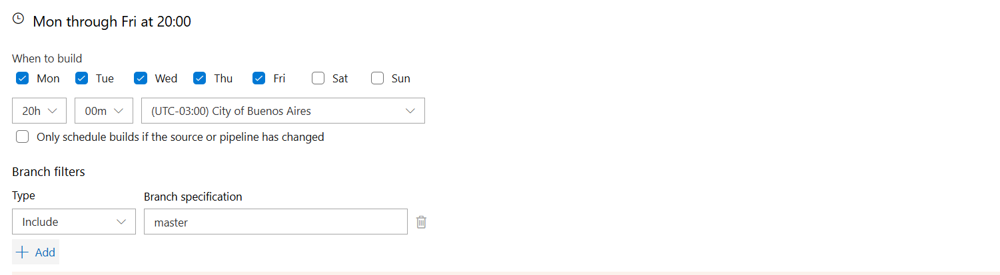

# Automation pipeline: Turn on the Ec2 instances
This repository features an Azure Pipeline designed to automate the process of starting and managing an EC2 instance in AWS. It includes commands to launch an Ec2 instance, monitor its status, and manage its lifecycle efficiently. This setup helps streamline infrastructure management, reduce manual effort, and ensure that instances are started and checked reliably within your deployment workflows.

### 🛠️For the use the schema
* Aws account and a EC2
* Azure devOps account
* * Create new pipeline
* * Add variables in the pipeline

#### Pipelines variables
```
AWS_ACCOUNT_ACCESS_KEY_ID
AWS_ACCOUNT_SECRET_ACCESS_KEY
AWS_INSTANCE_ID
AWS_REGION
```

### ⚡Triggers in Azure Devops
We can configure pipelines to run on the days we need:
- Create pipeline in Azure Devops
- Setting pipeline with this repository and azure-pipelines.yml
- Select Triggers and Scheduled
- Scheduled detail:

<div align="center">
  
</div>


